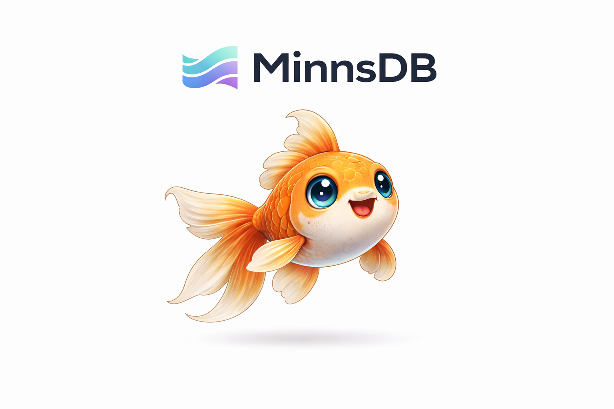

<p align="center">
  
</p>

<h1 align="center">MinnsDB</h1>

<p align="center">
  <strong>The agentic database — graph + tables + WASM agents in one binary.</strong><br>
  Ingest conversations. Query with MinnsQL. Run sandboxed agents. Subscribe to live changes.
</p>

<p align="center">
  <a href="https://github.com/Minns-ai/EventGraphDB/actions/workflows/ci.yml"></a>
  <a href="LICENSE"></a>
  <a href="https://www.rust-lang.org/"></a>
  <a href="https://discord.gg/6a2cCRPwUR"></a>
</p>

<p align="center">
  <a href="#quick-start">Quick Start</a> &middot;
  <a href="API_REFERENCE.md">API Reference</a> &middot;
  <a href="https://discord.gg/6a2cCRPwUR">Discord</a> &middot;
  <a href="https://minns.ai">Website</a>
</p>

<p align="center">
  
</p>

---

## What is MinnsDB?

MinnsDB is a database purpose-built for AI agent workloads. It combines a temporal knowledge graph, a relational table engine, and a sandboxed WASM agent runtime into a single Rust binary.

**Graph** — send in conversations, get typed knowledge edges with temporal validity. Every fact has a `valid_from` and `valid_until`. Nothing is deleted, only superseded.

**Tables** — a full bi-temporal row store with page-based storage, blake3 checksums, SQL-style CRUD, JOINs, and bulk import. Tables and graph are co-equal — connected via NodeRef columns.

**WASM Agents** — upload sandboxed modules that read/write tables, query the graph, call external APIs, and trigger on events. Instruction-metered, memory-capped, permission-controlled.

**MinnsQL** — one query language for everything: graph pattern matching (`MATCH`), table queries (`FROM`), DDL (`CREATE TABLE`), DML (`INSERT`/`UPDATE`/`DELETE`), and JOINs across tables and graph.

---

## Quick start

```bash
git clone https://github.com/Minns-ai/EventGraphDB.git
cd EventGraphDB
cargo build --release
cargo run --release -p minnsdb-server
```

On first boot, the server generates a root API key and prints it once:

```
========================================
  ROOT API KEY (save this — shown once):
  mndb_a1b2c3d4e5f6789...
========================================
Listening on http://0.0.0.0:3000
```

All requests require the API key:

```bash
export MINNS_KEY="mndb_a1b2c3d4e5f6789..."

# Health check
curl -H "Authorization: Bearer $MINNS_KEY" http://localhost:3000/api/health
```

For development, disable auth with `MINNS_AUTH_DISABLED=true`.

---

## 60-second demo

```bash
# 1. Create a table
curl -X POST http://localhost:3000/api/query \
  -H "Authorization: Bearer $MINNS_KEY" \
  -H 'Content-Type: application/json' \
  -d '{"query": "CREATE TABLE orders (id Int64 PRIMARY KEY, customer String NOT NULL, amount Float64, status String)"}'

# 2. Insert data
curl -X POST http://localhost:3000/api/query \
  -H "Authorization: Bearer $MINNS_KEY" \
  -H 'Content-Type: application/json' \
  -d '{"query": "INSERT INTO orders VALUES (1, \"Alice\", 99.99, \"pending\")"}'

# 3. Query with MinnsQL
curl -X POST http://localhost:3000/api/query \
  -H "Authorization: Bearer $MINNS_KEY" \
  -H 'Content-Type: application/json' \
  -d '{"query": "FROM orders WHERE orders.status = \"pending\" RETURN orders.customer, orders.amount"}'
# → {"columns": ["orders.customer", "orders.amount"], "rows": [["Alice", 99.99]], ...}

# 4. Ingest a conversation into the graph
curl -X POST http://localhost:3000/api/events/simple \
  -H "Authorization: Bearer $MINNS_KEY" \
  -H 'Content-Type: application/json' \
  -d '{"agent_id": 1, "agent_type": "assistant", "session_id": 1, "action": "chat", "data": {"message": "User moved from London to Berlin for a job at Stripe"}}'

# 5. Query the graph
curl -X POST http://localhost:3000/api/query \
  -H "Authorization: Bearer $MINNS_KEY" \
  -H 'Content-Type: application/json' \
  -d '{"query": "MATCH (n) RETURN n.id, n.type LIMIT 10"}'

# 6. Subscribe to live updates
curl -X POST http://localhost:3000/api/query \
  -H "Authorization: Bearer $MINNS_KEY" \
  -H 'Content-Type: application/json' \
  -d '{"query": "SUBSCRIBE MATCH (n) RETURN n.id, n.type LIMIT 50"}'
# → {"subscription_id": 1, "columns": [...], "rows": [...], "strategy": "incremental"}
```

---

## Why MinnsDB?

| | Vector DB | Graph DB (external graph backend) | KV + embeddings | **MinnsDB** |
|---|---|---|---|---|
| Tracks relationships | No | Yes | No | **Yes** — typed edges with temporal validity |
| Relational tables | No | No | No | **Yes** — bi-temporal row store with JOINs |
| Handles contradictions | Last write wins | Last write wins | Last write wins | **Confidence scoring** — claims compete |
| Understands time | No | Manual | No | **Built-in** — every edge and row has `valid_from`/`valid_until` |
| Runs agent code | No | No | No | **Yes** — sandboxed WASM with permissions + metering |
| Accepts raw conversation | No | No | No | **Yes** — LLM compaction extracts facts automatically |
| Reactive live queries | No | No | No | **Yes** — incremental updates via REST or WebSocket |
| Auth built in | Varies | Bolt auth | Varies | **Yes** — API keys with group scoping + permissions |
| External deps | Vector service | JVM + Cypher | Redis/Postgres | **None** — single binary, embedded ReDB |

---

## Core Systems

### 1. Temporal Knowledge Graph

The graph is the primary knowledge structure. Conversations are ingested, facts are extracted, and typed edges are created with temporal validity.

```
POST /api/conversations/ingest   →  LLM compaction  →  Graph edges
POST /api/events/simple          →  Direct graph construction
POST /api/nlq                    →  Natural language query against graph
POST /api/query                  →  MinnsQL graph query (MATCH ...)
```

Edge types follow `{category}:{predicate}`:
```
location:lives_in     relationship:colleague    financial:payment
work:employed_at      preference:prefers        routine:morning
```

Property behaviors defined in OWL/RDFS Turtle files (`data/ontology/*.ttl`):
- `owl:FunctionalProperty` — single-valued, new value supersedes old
- `owl:SymmetricProperty` — bidirectional
- `owl:TransitiveProperty` — transitive closure
- `eg:appendOnly` — immutable history
- `eg:cascadeDependents` — changing one property invalidates dependents

### 2. Temporal Tables

A page-based relational row store that lives alongside the graph.

```sql
-- DDL
CREATE TABLE customers (id Int64 PRIMARY KEY, name String NOT NULL, region String)
CREATE TABLE orders (id Int64 PRIMARY KEY, customer_id Int64, amount Float64, status String)

-- DML
INSERT INTO orders VALUES (1, 100, 99.99, "pending")
UPDATE orders SET status = "shipped" WHERE id = 1
DELETE FROM orders WHERE status = "cancelled"

-- Queries
FROM orders WHERE orders.amount > 50.0 RETURN orders.id, orders.customer_id ORDER BY orders.amount DESC
FROM orders WHEN ALL RETURN orders.id, orders.status, orders.valid_from, orders.valid_until

-- Table-to-table JOINs
FROM orders JOIN customers ON orders.customer_id = customers.id
RETURN customers.name, orders.amount
```

**Storage internals:**
- 8KB slotted pages with blake3 checksums
- Custom binary row format with O(1) column access
- Bi-temporal versioning — every UPDATE creates a new version, closes the old one
- Dead slot reuse, predicate pushdown for PK lookups
- In-memory indexes rebuilt from pages on startup
- Column types: `String`, `Int64`, `Float64`, `Bool`, `Timestamp`, `Json`, `NodeRef`

**REST API:** 9 endpoints — `POST /api/tables` (create), `DELETE /api/tables/:name` (drop), `POST /api/tables/:name/rows` (insert), `PUT /api/tables/:name/rows/:id` (update), `DELETE /api/tables/:name/rows/:id` (delete), `GET /api/tables/:name/rows` (scan with `?when=all`, `?as_of=`), `GET /api/tables/:name/by-node/:id` (NodeRef reverse lookup), `POST /api/tables/:name/compact`, `GET /api/tables/:name/stats`.

### 3. WASM Agent Runtime

Upload sandboxed WASM modules that interact with the database.

```bash
# Upload a module
curl -X POST http://localhost:3000/api/modules \
  -H "Authorization: Bearer $MINNS_KEY" \
  -H 'Content-Type: application/json' \
  -d '{"name": "order-processor", "wasm_base64": "<base64>", "permissions": ["table:orders:read", "table:orders:write"]}'

# Call a function
curl -X POST http://localhost:3000/api/modules/order-processor/call/process \
  -H "Authorization: Bearer $MINNS_KEY" \
  -H 'Content-Type: application/json' \
  -d '{"args_base64": "<msgpack args>"}'

# Check usage
curl -H "Authorization: Bearer $MINNS_KEY" http://localhost:3000/api/modules/order-processor/usage
```

**Sandboxing:**
- Per-call instruction budget ("life") — default ~1 minute of WASM, resets each call
- 30s wall-time limit via epoch interruption (10ms ticks)
- 64MB memory cap enforced by wasmtime
- Permission system: modules declare needs, admin approves at upload

**Permissions:** `table:<name>:read`, `table:<name>:write`, `table:*:read`, `graph:query`, `http:fetch:<domain>`, `http:fetch:*`, `schedule`

**Host functions:** `table_get`, `table_insert`, `table_delete`, `table_query`, `graph_query`, `http_fetch` (SSRF-hardened), `log`, `result_len`, `module_id`, `group_id`

**Triggers:** HTTP call, table insert/update/delete, graph edge/node changes, cron schedules

**Usage metering:** Every call records life consumed, rows read/written, HTTP requests/bytes. Resettable monthly via `POST /api/modules/:name/usage/reset`.

**Data exchange:** MessagePack for all host-to-module communication.

### 4. MinnsQL

One query language for graph and tables:

```sql
-- Graph queries
MATCH (a:Person)-[r:KNOWS]->(b:Person) WHERE r.confidence > 0.8 RETURN a.name, b.name
MATCH (a)-[r]->(b) WHEN LAST "30d" RETURN a.name, count(*) AS cnt ORDER BY cnt DESC LIMIT 10

-- Table queries
FROM orders WHERE orders.status = "pending" RETURN orders.id, orders.amount
FROM orders JOIN customers ON orders.customer_id = customers.id RETURN customers.name, orders.amount

-- DDL/DML
CREATE TABLE items (id Int64 PRIMARY KEY, name String, price Float64)
INSERT INTO items (id, name, price) VALUES (1, "Widget", 9.99), (2, "Gadget", 19.99)
UPDATE items SET price = 12.99 WHERE name = "Widget"
DELETE FROM items WHERE id = 2
DROP TABLE items

-- Temporal
MATCH (a)-[r]->(b) WHEN ALL RETURN a.name, valid_from(r), valid_until(r)
MATCH (a)-[r]->(b) WHEN "2025-01-01" TO "2025-06-01" AS OF "2025-07-01" RETURN a.name
FROM orders WHEN ALL RETURN orders.id, orders.valid_from, orders.valid_until

-- Subscriptions
SUBSCRIBE MATCH (n:Person) RETURN n.name, n.id
UNSUBSCRIBE 7
```

**Built-in functions:** `type()`, `id()`, `labels()`, `properties()`, `now()`, `coalesce()`, `valid_from()`, `valid_until()`, `duration()`, `open_ended()`, `time_bucket()`, `date_trunc()`, `ago()`, `count()`, `sum()`, `avg()`, `min()`, `max()`, `collect()`, `path()`, `hops()`, `SUCCESSIVE()`, `CHANGED()`, `overlap()`, `precedes()`, `meets()`, `covers()`, and more.

Full language reference: [API_REFERENCE.md](API_REFERENCE.md#minnsql-language-reference)

### 5. Authentication

API key-based authentication with group scoping and permissions.

```bash
# Create a scoped key (admin only)
curl -X POST http://localhost:3000/api/keys \
  -H "Authorization: Bearer $MINNS_KEY" \
  -H 'Content-Type: application/json' \
  -d '{"name": "my-app", "group_id": 1, "permissions": ["read", "write", "query"]}'
# → {"key": "mndb_...", "warning": "Save this key — it cannot be retrieved again."}

# List keys
curl -H "Authorization: Bearer $MINNS_KEY" http://localhost:3000/api/keys

# Delete a key
curl -X DELETE -H "Authorization: Bearer $MINNS_KEY" http://localhost:3000/api/keys/my-app
```

- Keys are `mndb_` + 64 hex chars (32 random bytes)
- Stored as blake3 hashes — raw keys never persisted
- Admin keys access all groups; scoped keys access one group
- Permissions: `admin`, `read`, `write`, `query`, `tables`, `modules`, `ingest`, `subscribe`
- Root key generated on first boot, printed once to console
- `MINNS_AUTH_DISABLED=true` for development

### 6. Reactive Subscriptions

Register MinnsQL queries as live subscriptions. Get incremental updates as data changes.

**REST polling:**
```bash
curl -X POST http://localhost:3000/api/subscriptions \
  -H "Authorization: Bearer $MINNS_KEY" \
  -H 'Content-Type: application/json' \
  -d '{"query": "MATCH (a)-[e:KNOWS]->(b) RETURN a.name, b.name"}'
# → {"subscription_id": 7, "initial": {"columns": [...], "rows": [...]}, "strategy": "incremental"}

curl -H "Authorization: Bearer $MINNS_KEY" http://localhost:3000/api/subscriptions/7/poll
# → {"updates": [{"inserts": [["Alice", "Diana"]], "deletes": []}]}
```

**WebSocket:**
```javascript
const ws = new WebSocket("ws://localhost:3000/api/subscriptions/ws");
ws.send(JSON.stringify({ type: "subscribe", query: "MATCH (n) RETURN n.name" }));
ws.onmessage = (msg) => console.log(JSON.parse(msg.data));
```

---

## Architecture

```
minnsdb/
├── crates/
│   ├── agent-db-core/          # Core types: Timestamp, NodeId, RowId, GroupId
│   ├── agent-db-events/        # Event struct, 8 EventType variants
│   ├── agent-db-storage/       # ReDB backend (30+ tables)
│   ├── agent-db-graph/         # GraphEngine — orchestrator
│   │                           #   Conversation compaction, NLQ pipeline
│   │                           #   Episode detection, claims extraction
│   │                           #   MinnsQL (parser, planner, executor, table executor)
│   │                           #   Reactive subscriptions, graph algorithms
│   │                           #   OWL/RDFS ontology, structured memory
│   ├── agent-db-tables/        # Temporal row store
│   │                           #   8KB slotted pages, blake3 checksums
│   │                           #   Row codec, page store, table engine
│   │                           #   Catalog, compaction, CSV/JSON import
│   ├── minns-wasm-runtime/     # WASM agent runtime
│   │                           #   Wasmtime, host functions, permissions
│   │                           #   Module lifecycle, triggers, scheduler
│   │                           #   Usage metering, MessagePack ABI
│   ├── minns-auth/             # API key authentication
│   │                           #   Key generation, blake3 hashing, permissions
│   │                           #   Group scoping, ReDB persistence
│   ├── agent-db-ast/           # Tree-sitter AST: Rust, Python, TS, JS, Go
│   └── agent-db-ner/           # External NER service client
├── ml/
│   ├── agent-db-world-model/   # Energy-based model critic [WIP]
│   └── agent-db-planning/      # LLM planning pipeline [WIP]
├── server/                     # Axum HTTP server
│   ├── src/handlers/           # 22 handler modules
│   └── tests/end_to_end.rs     # Full E2E integration test
├── data/ontology/              # OWL/RDFS Turtle files
└── examples/                   # Rust examples
```

**Key internals:**
- **GraphEngine** — central orchestrator holding graph, memory store, strategy store, claim store, NLQ pipeline, ontology registry
- **Graph** — `SlotVec` arena allocation, 11 node types, bi-temporal edges, configurable max size with pruning
- **Table engine** — 8KB pages, custom binary row format, 6 index types, commit flags for crash safety
- **WASM runtime** — wasmtime with instruction metering, epoch interruption, `StoreLimits` for memory
- **Write lanes** — sharded by session_id, bounded capacity, per-lane latency tracking
- **Reactive engine** — `DeltaBatch` broadcast, trigger-set fast rejection, incremental operator state
- **Persistence** — ReDB with 30+ tables, raw page blobs for table store, blake3 content-addressed WASM blobs

---

## Configuration

| Variable | Default | Description |
|----------|---------|-------------|
| `SERVER_HOST` | `0.0.0.0` | Bind address |
| `SERVER_PORT` | `3000` | Bind port |
| `MINNS_AUTH_DISABLED` | `false` | Set `true` to disable API key auth (dev only) |
| `RUST_LOG` | `info` | Log level |
| `SERVICE_PROFILE` | `normal` | `normal` or `free` (controls cache sizes + limits) |
| `LLM_API_KEY` | — | OpenAI-compatible key (required for conversation ingest + claims) |
| `LLM_MODEL` | `gpt-4o-mini` | LLM model for compaction |
| `WRITE_LANE_COUNT` | `num_cpus/2` | Write lane concurrency (clamped 2-8) |
| `WRITE_LANE_CAPACITY` | `128` | Per-lane queue depth |
| `READ_GATE_PERMITS` | `num_cpus*2` | Concurrent read permits |
| `REDB_CACHE_SIZE_MB` | `256` | ReDB page cache |
| `NER_SERVICE_URL` | `http://localhost:8081/ner` | External NER service |
| `ENABLE_WORLD_MODEL` | `false` | Enable energy-based world model [WIP] |
| `ENABLE_LOUVAIN` | `true` | Background community detection |
| `SUBSCRIPTION_INTERVAL_MS` | `50` | Subscription processing interval |
| `CORS_ALLOWED_ORIGINS` | — | Comma-separated CORS origins |

---

## REST API

**Base URL:** `http://localhost:3000`

All requests require `Authorization: Bearer mndb_<key>` (unless `MINNS_AUTH_DISABLED=true`).

Full reference: [API_REFERENCE.md](API_REFERENCE.md)

| Group | Key Endpoints |
|-------|--------------|
| **Auth** | `POST /api/keys` — create key (admin)<br>`GET /api/keys` — list keys<br>`DELETE /api/keys/:name` — delete key |
| **Tables** | `POST /api/tables` — create table<br>`DELETE /api/tables/:name` — drop<br>`POST/GET /api/tables/:name/rows` — insert/scan<br>`PUT/DELETE /api/tables/:name/rows/:id` — update/delete<br>`GET /api/tables/:name/stats` — stats<br>`POST /api/tables/:name/compact` — compaction |
| **MinnsQL** | `POST /api/query` — execute any MinnsQL (MATCH, FROM, CREATE TABLE, INSERT, etc.) |
| **WASM Modules** | `POST /api/modules` — upload<br>`POST /api/modules/:name/call/:fn` — call function<br>`GET /api/modules/:name/usage` — usage stats<br>`POST /api/modules/:name/usage/reset` — billing reset<br>`POST/GET /api/modules/:name/schedules` — cron |
| **Conversations** | `POST /api/conversations/ingest` — batch (requires LLM)<br>`POST /api/messages` — streaming with auto-compaction |
| **Queries** | `POST /api/nlq` — natural language<br>`POST /api/search` — keyword/semantic/hybrid<br>`POST /api/claims/search` — claim search |
| **Subscriptions** | `POST /api/subscriptions` — create<br>`GET /api/subscriptions/:id/poll` — poll<br>`GET /api/subscriptions/ws` — WebSocket |
| **Events** | `POST /api/events/simple` — simple event<br>`POST /api/events` — full event<br>`POST /api/events/state-change` — typed state change<br>`POST /api/events/transaction` — typed transaction |
| **Graph & Analytics** | `GET /api/graph` — structure<br>`GET /api/communities` — Louvain/LP<br>`GET /api/centrality` — PageRank/betweenness<br>`GET /api/reachability` — temporal reachability |
| **Admin** | `POST /api/admin/export` — binary export<br>`POST /api/admin/import` — import<br>`GET /api/health` — health check |

---

## Development

```bash
cargo build                                              # Build all crates
cargo test --workspace                                   # 1,100+ tests
cargo clippy --all-targets --all-features -- -D warnings # Lint (zero warnings)
cargo audit                                              # Security audit (zero vulnerabilities)
cargo fmt --all                                          # Format
cargo run --release -p minnsdb-server                    # Run server
```

### Run the E2E test

```bash
cargo test -p minnsdb-server --test end_to_end -- --nocapture
```

Tests 15 scenarios: table CRUD, MinnsQL queries, JOINs, temporal history, graph events, subscriptions, parallel requests (20 concurrent).

---

## What's stable, what's WIP

| Component | Status |
|-----------|--------|
| Temporal tables (CRUD, temporal queries, compaction, persistence) | **Stable** |
| MinnsQL (graph + table queries, DDL, DML, JOINs) | **Stable** |
| WASM agent runtime (sandboxing, permissions, metering, triggers) | **Stable** |
| API key authentication | **Stable** |
| Conversation ingestion + LLM compaction | **Stable** |
| Natural language queries (NLQ) | **Stable** |
| Graph construction + temporal edges + ontology | **Stable** |
| Episode detection | **Stable** |
| Claims extraction + hybrid search | **Stable** |
| Graph algorithms (Louvain, PageRank, centrality) | **Stable** |
| Reactive subscriptions (REST + WebSocket) | **Stable** |
| Persistence + export/import | **Stable** |
| Write lanes + read gate | **Stable** |
| Memory formation (consolidation, tiers) | **WIP** |
| Strategy extraction (RL on edge weights) | **WIP** |
| Energy-based world model | **WIP** |
| LLM planning pipeline | **WIP** |

---

## License

MinnsDB is licensed under the **Business Source License 1.1 (BSL)**.

- **Free for non-production use** and single-instance production use
- **Not permitted** for hosted services or competitive offerings without a commercial license
- **Converts to AGPL v3.0 with linking exception** on 2030-03-18
- The linking exception means you do not need to open-source your own code — only changes to MinnsDB itself

See [LICENSE](LICENSE) for the full text.

Copyright (c) 2026 Journey Into Product Ltd
